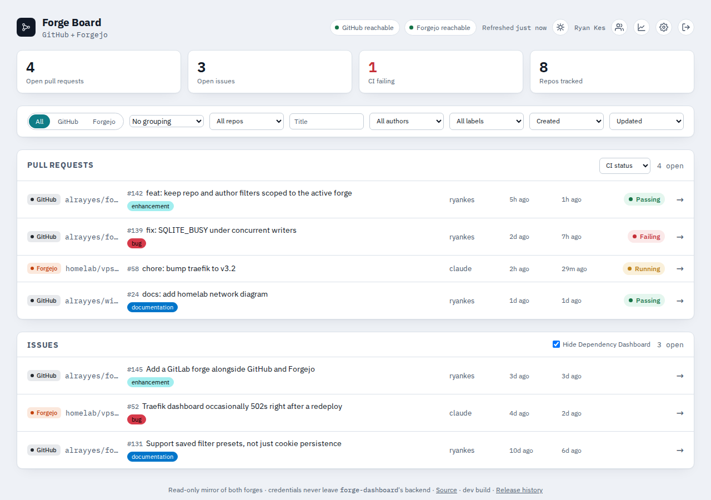
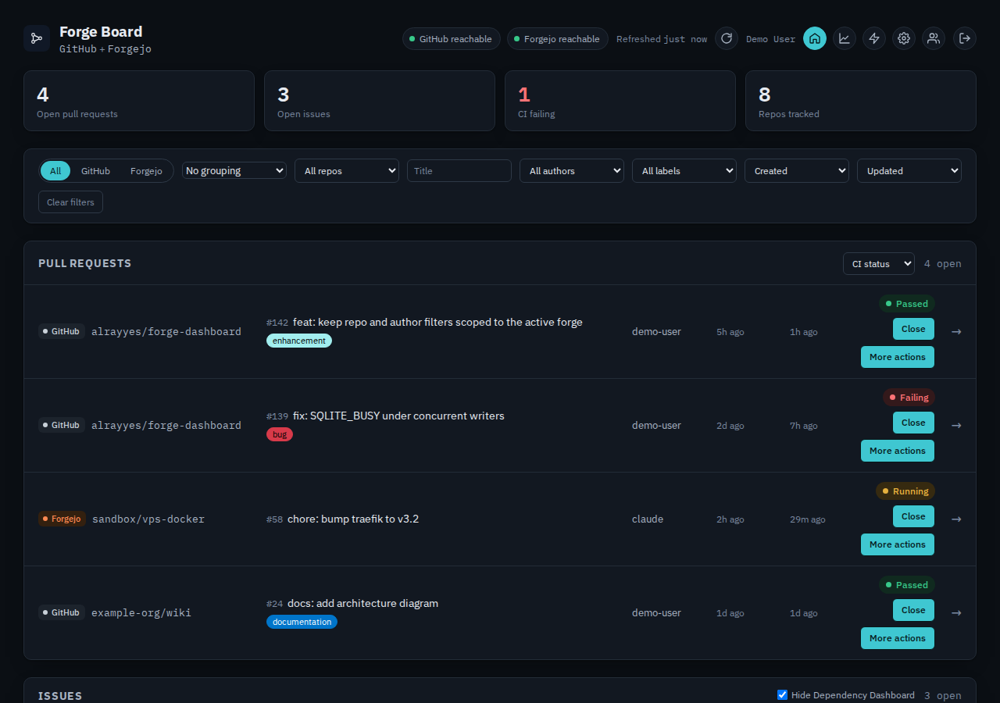

# forge-dashboard

[](https://github.com/alrayyes/forge-dashboard/actions/workflows/ci.yml)
[](https://github.com/alrayyes/forge-dashboard/releases/latest)
[](LICENSE)

A single-page dashboard of open pull requests, issues, and CI status across
every repository you have write access to on **GitHub** and a **Forgejo**
instance — one page instead of two forge UIs. See
[#1](https://github.com/alrayyes/forge-dashboard/issues/1) for the v1
acceptance criteria this was built against, and
[#3](https://github.com/alrayyes/forge-dashboard/issues/3) for the
passwordless login, per-user tokens, sharing, and an admin role this document
now describes the first slice of.




Fixture data, not a real account's actual repositories — regenerated
automatically by the release workflow on every release (see
`scripts/capture-screenshots.js`), so it's never more than one release
stale.

## Design

- **Passkey login, no passwords anywhere.** Registration and sign-in are
  real [WebAuthn](https://webauthn.io) ceremonies — works with Proton
  Pass, 1Password, iCloud Keychain, a platform authenticator, or a
  hardware key, anything that speaks passkeys. Nothing password-shaped is
  ever stored or transmitted.
- **Every user configures their own forges.** Each signed-in user has
  their own GitHub/Forgejo tokens, set from the Settings page, and sees
  only their own dashboard — nobody else's tokens, nobody else's repos.
- **Credentials never reach the browser.** The Go backend holds every
  user's tokens server-side, encrypted at rest, and only ever hands the
  frontend its own already-filtered JSON. Confirm this yourself: open the
  browser's network tab and watch it call nothing but `/api/dashboard`,
  `/api/settings`, `/api/auth/*` and `/healthz` — and that `/api/settings`
  never echoes a token back, only whether one is set.
- **One Go binary, no frontend build step.** Plain HTML/CSS/JS, embedded
  into the binary with `//go:embed`. `go build` is the whole pipeline — no
  Node toolchain needed to run the service, only to run its own lint/test
  tooling (see [CONTRIBUTING.md](CONTRIBUTING.md)).
- **Read-only against both forges.** Nothing here writes back to GitHub or
  Forgejo. It aggregates and displays; every row links out to the real
  thing.

### Where this stands against #3

This ships every piece of #3: passkey registration and login gating the
dashboard, per-user GitHub/Forgejo tokens (every signed-in user
configures their own forges from the Settings page and sees only their
own dashboard by default), an admin area for whoever registers first
(list every registered user, revoke a user's passkeys and sessions
without deleting their account, or remove one outright), and dashboard
sharing (grant another registered user read-only access to your own
dashboard, from Settings).

## Requirements

- **Go 1.27 or newer**, to build.
- **A passkey-capable browser** to sign in at all — any current Chrome,
  Safari, Firefox or Edge; a phone counts too. Nothing else to install.
- **Somewhere writable for the database** (`DB_PATH`, default
  `/data/forge-dashboard.db`) that survives a restart — registered
  passkeys, sessions, and every user's encrypted forge credentials live
  there. In Docker that means a mounted volume at `/data`; see **Docker**
  below.
- **`ENCRYPTION_KEY`**, a base64-encoded 32-byte key the process refuses
  to start without — see **Configuration** below for how to generate one.
  It's what encrypts every user's forge tokens at rest; there's no
  sensible default for a secret like this one.
- Each signed-in user configures their own forge credentials from the
  Settings page after registering — see **Credentials** below for exactly
  which permissions to grant. Nothing forge-related needs setting before
  the process starts.

## Authentication

The first visit registers a passkey; every visit after that signs in with
it — no password, no separate account system. `POST /api/auth/register/begin`
and `.../finish` run the WebAuthn registration ceremony,
`.../login/begin`/`.../finish` run the login ceremony, and a signed
session cookie (`HttpOnly`, `SameSite=Lax`, `Secure` whenever the request
arrived over HTTPS) is what actually gates `/` and `/api/dashboard`
afterward — see `internal/auth` and `api/openapi.yaml`'s `auth` tag.

- **Whoever registers first becomes admin.** No environment variable to
  set or get wrong — the deployment's own network boundary
  (Tailscale-only, see **Deployment** below) is what actually keeps a
  stranger from racing to register before you do, the same protection
  an explicit `ADMIN_USERNAME` variable would only duplicate. See
  **Admin area** below for what an admin can do.
- **`RP_ID`** / **`RP_ORIGIN`** configure the WebAuthn relying party.
  They default to `localhost` / `http://localhost:8080` for a local run;
  a real deployment **must** set both to its real domain, or every
  passkey registered against the default refuses to work there — a
  passkey is cryptographically bound to the origin it was created for,
  not something this service can paper over after the fact.

## Admin area

Whoever registers first gets an Admin link in the dashboard header,
leading to `/admin.html`: a list of every registered user, with two
actions per row.

- **Revoke** signs a user out everywhere and clears every passkey they've
  registered, without touching their account or saved forge credentials
  — they have to register a new passkey from scratch to get back in.
  Useful for a lost device or a compromised passkey manager, short of
  removing the person entirely.
- **Remove** deletes the account outright — passkeys, sessions, and
  saved forge credentials all go with it, and the username becomes
  available for a fresh registration. Irreversible.

Neither action works on the admin's own account (the backend refuses it
with a 400, and the frontend disables both buttons on that row) — there's
no recovery path for locking yourself out this way.

## Sharing

From Settings, share your own dashboard with another registered user,
read-only — they need no GitHub/Forgejo credentials of their own
configured. Once shared, a selector appears in their dashboard header
so they can switch between their own dashboard and yours; Settings also
lists everyone who's shared their dashboard with you, and everyone
you've shared yours with, with a one-click way to stop.

Enforced server-side (`GET /api/dashboard?owner=<username>` answers 403
without an active share, not just a hidden frontend control) — see
`internal/sharing` and `api/openapi.yaml`'s `sharing` tag.

## Credentials

Set from the Settings page (`/settings.html`, linked from the dashboard
header) once you're signed in — nothing forge-related is configured by
the process itself. Each forge takes either a token (sees private repos
too) or a bare username (public repos only, no credential at all) —
never both purposes at once. A token always wins over a username if you
set both, and leaving a token field blank on save keeps whatever was
saved before, so updating your username doesn't mean re-pasting the
token too.

### GitHub

- **Token**: a personal access token with read access to the
  repositories you want tracked.
  - Classic token: the `repo` scope.
  - Fine-grained token: **Contents**, **Issues**, **Pull requests**
    (Read-only), plus **Metadata** (Read-only, mandatory on every
    fine-grained token regardless).
- **Username only** (token left blank): shows that account's public
  repositories, fully unauthenticated — the same data anyone gets
  landing on `github.com/<username>?tab=repositories`. Verified live
  against a real 105-public-repo account. Unauthenticated GitHub API
  calls are capped at **60 requests/hour**, so this mode only sees
  everything on an account small enough to fit that budget — a token
  (5,000/hour) is what an account this size actually needs.

### Forgejo

- **Token**: `Settings → Applications → Generate New Token`, with
  **`read:repository`**, **`read:issue`**, and **`read:user`** all
  checked. `read:user` is easy to miss — it isn't obviously related to
  repos, but `GET /user/repos` (how repository discovery works) refuses
  a token without it: confirmed live against a real instance, `403
token does not have at least one of required scope(s): [read:user]`,
  before `read:user` was added to the token.
- **Username only** (token left blank, instance URL still set): shows
  that account's public repositories on the configured instance,
  unauthenticated — same trade-off as GitHub's username mode. Verified
  against a real Forgejo instance's `GET /users/<username>/repos`.

## Webhooks

Optional. Without one, the dashboard still refreshes on its own schedule
and the browser tab polls it every 30 seconds; a webhook just means a new
pull request, a closed issue, or a CI status change on a tracked repo
shows up within seconds instead of at the next poll. Set up from the
Settings page, one forge at a time — full copy-pasteable steps and how
delivery verification works: [docs/webhooks.md](docs/webhooks.md).

## Configuration

Everything the process itself needs is environment variables — no
config file, and nothing forge-related, since that's per-user now (see
**Credentials** above):

| Variable           | Required | Default                    | Meaning                                                                                                  |
| ------------------ | -------- | -------------------------- | -------------------------------------------------------------------------------------------------------- |
| `ADDR`             | no       | `:8080`                    | Listen address.                                                                                          |
| `DB_PATH`          | no       | `/data/forge-dashboard.db` | Where passkeys, sessions, and every user's encrypted forge credentials live.                             |
| `RP_ID`            | no       | `localhost`                | The WebAuthn relying party ID — set to your real domain in any real deployment.                          |
| `RP_ORIGIN`        | no       | `http://localhost:8080`    | The WebAuthn relying party origin — set to the real `https://` origin users reach this at.               |
| `ENCRYPTION_KEY`   | **yes**  | —                          | Base64-encoded 32-byte key for encrypting forge tokens at rest. Generate with `openssl rand -base64 32`. |
| `REFRESH_INTERVAL` | no       | `5m`                       | How often the backend re-polls a signed-in user's forges, as a Go duration (`2m30s`, `10m`).             |

Repository discovery is automatic per user. With a token, the dashboard
lists every repository it has push access to (`GET /user/repos` on both
APIs); with only a username, it lists that account's public repositories
(`GET /users/<username>/repos`, also both APIs) with no credential in
play at all. Either way there's no per-repo allowlist to maintain —
archived and forked repositories are excluded automatically, on both
forges, in either mode. On Forgejo, a mirrored repository is excluded too
— a pull mirror has no pull requests or issues of its own to poll, and its
canonical home is whichever forge it's mirrored from.

## Running it

```sh
go build -o forge-dashboard ./cmd/forge-dashboard
mkdir -p data
DB_PATH=./data/forge-dashboard.db \
  ENCRYPTION_KEY="$(openssl rand -base64 32)" \
  ./forge-dashboard
```

Then open `http://localhost:8080`, register a passkey — `RP_ID`/
`RP_ORIGIN` default to `localhost`/`http://localhost:8080`, which matches
this local run with nothing extra to set — and add your GitHub/Forgejo
credentials from the Settings page.

### Docker

The `/data` directory the image ships is where the database goes — mount
a volume there, or every passkey and every saved credential is gone the
moment the container is recreated:

```sh
docker build -t forge-dashboard .
docker run --rm -p 8080:8080 \
  --cap-drop=ALL --security-opt=no-new-privileges --read-only \
  --memory=64m --cpus=0.5 \
  -v forge-dashboard-data:/data \
  -e RP_ID=localhost -e RP_ORIGIN=http://localhost:8080 \
  -e ENCRYPTION_KEY="$(openssl rand -base64 32)" \
  forge-dashboard
```

Generate `ENCRYPTION_KEY` once and keep it — losing it makes every saved
credential unrecoverable, and every user has to re-enter theirs from the
Settings page.

The published image is `ghcr.io/alrayyes/forge-dashboard`, built and
pushed on every release by `.goreleaser.yml`'s `dockers:` block — tagged
by version and `:latest`, `linux/amd64` and `linux/arm64`.

## Deployment

Deployed on a homelab, reachable only over Tailscale. Passkey login is
now the actual access control — the tailnet is defence in depth on top
of it, not the only thing standing between a visitor and the dashboard
the way v1 originally had it. The image is pulled into that homelab's
existing `vps-docker` compose setup as its own service directory, routed
through the Traefik instance already running there; there's no
per-service Tailscale sidecar, since every service on that host reaches
the tailnet the same way. That deployment config — including the `/data`
volume this now needs, and `RP_ID`/`RP_ORIGIN` set to the real deployed
domain rather than the `localhost` defaults — lives in `vps-docker`, not
here.

## API

`api/openapi.yaml` is the contract: `GET /healthz` for liveness,
`GET /api/dashboard` for the signed-in user's aggregated snapshot (or,
with `?owner=<username>`, one shared with them), `GET`/`PUT
/api/settings` for that user's own GitHub/Forgejo configuration — the
`PUT` response never echoes a token back, only whether one is now set
— `GET/PUT/DELETE /api/sharing(/{username})` for managing who can see
your dashboard, and `GET /api/admin/users` plus the revoke/delete
endpoints under `admin`, every one of them refusing anyone but the
designated admin. `redocly lint` validates it; nothing yet asserts the
handlers still match it (see
[CONTRIBUTING.md](CONTRIBUTING.md#how-it-fits-together)).

## Contributing

See [CONTRIBUTING.md](CONTRIBUTING.md) for the toolchain, the hooks, and
how a change gets reviewed and released.

## Licence

[AGPL-3.0](LICENSE). Chosen over the plain GPL-3.0 this project started
under because AGPL's network-use clause also covers running a modified
copy as a hosted service, which GPL alone doesn't.
