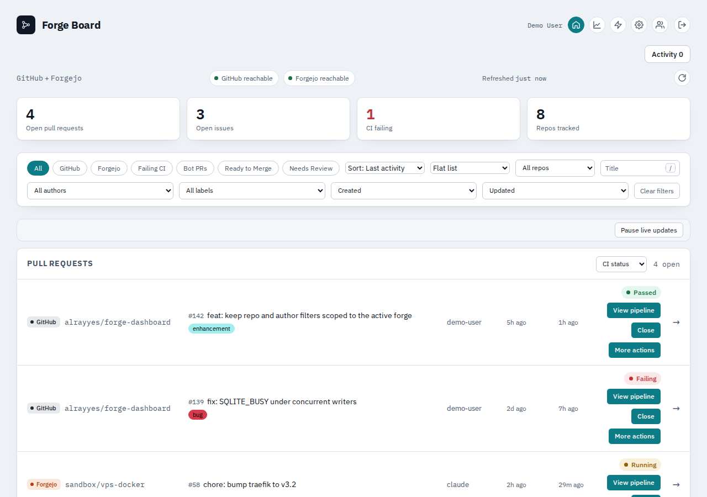
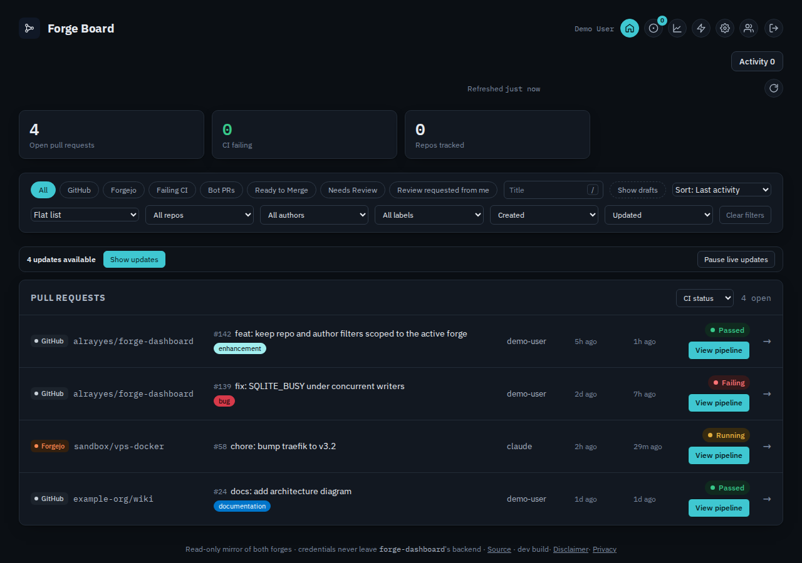

# forge-dashboard

[](https://github.com/alrayyes/forge-dashboard/actions/workflows/ci.yml)
[](https://github.com/alrayyes/forge-dashboard/releases/latest)
[](LICENSE)
[](https://codecov.io/gh/alrayyes/forge-dashboard)
[](https://pkg.go.dev/github.com/alrayyes/forge-dashboard)

A dashboard of open pull requests, issues, and CI status across
every repository you have write access to on **GitHub** and a **Forgejo**
instance — one page instead of two forge UIs. See
[#1](https://github.com/alrayyes/forge-dashboard/issues/1) for the v1
acceptance criteria this was built against, and
[#3](https://github.com/alrayyes/forge-dashboard/issues/3) for the
passwordless login, per-user tokens, sharing, and an admin role this document
now describes the first slice of.




Fixture data, not a real account's actual repositories — regenerated
automatically by the release workflow on every release (see
`scripts/capture-screenshots.ts`), so it's never more than one release
stale.

## Design

- **Passkey login, no passwords anywhere.** Registration and sign-in are
  real [WebAuthn](https://webauthn.io) ceremonies — works with Proton
  Pass, 1Password, iCloud Keychain, a platform authenticator, or a
  hardware key, anything that speaks passkeys. Nothing password-shaped is
  ever stored or transmitted.
- **Every user configures their own forges.** Each signed-in user has
  their own GitHub/Forgejo tokens, set from the Settings page, and sees
  only their own dashboard — nobody else's tokens, nobody else's repos.
- **Credentials never reach the browser.** The Go backend holds every
  user's tokens server-side, encrypted at rest, and only ever hands the
  frontend its own already-filtered JSON. Confirm this yourself: open the
  browser's network tab and watch it call nothing but `/api/dashboard`,
  `/api/settings`, `/api/auth/*` and `/healthz` — and that `/api/settings`
  never echoes a token back, only whether one is set.
- **An MCP endpoint for agents, `/api/mcp`, read-only like the rest of
  this app.** Authenticated the same way any other `/api/*` route already
  is — a personal API token (Settings → API tokens),
  `Authorization: Bearer <token>` — not a separate credential system. Its
  one tool, `get_dashboard`, mirrors `GET /api/dashboard` exactly
  (including its own `?owner=`/`owner` semantics for a dashboard someone
  else has shared with you) rather than adding a second, parallel path to
  the same data. Built on the official
  [MCP Go SDK](https://github.com/modelcontextprotocol/go-sdk), over the
  Streamable HTTP transport.
- **One Go binary.** The frontend — SvelteKit throughout, migrated
  incrementally one page at a time (see #326) — ends up embedded into
  the binary with `//go:embed`; a released binary needs nothing but
  `go build` to run. Building from source needs one extra step first,
  `bun run build:web`, to produce the pages `internal/api/static`
  embeds — run automatically in CI and the Docker build's own
  `web-build` stage, a manual step before a local `go build` otherwise.
  See [CONTRIBUTING.md](CONTRIBUTING.md) for the toolchain either half
  needs.
- **Read-only against both forges, with one caveat.** Nothing here writes
  back to GitHub or Forgejo — it aggregates and displays, and every row
  links out to the real thing. The caveat: checking whether a repo's
  webhook is already pointed at this dashboard (the Webhooks card, and the
  dashboard's own coverage summary) needs a token scope that includes
  write access on Forgejo, since its hooks API has no separate read-only
  scope — this app still only reads that list, and never creates or edits a
  hook itself.
- **A [WebMCP](https://github.com/webmachinelearning/webmcp) tool in the
  frontend itself, `get_dashboard`.** Experimental — as of this writing
  it's an Origin Trial in Chrome 149+/Edge 150+ only, with no stable spec
  yet — so this is a no-op everywhere else rather than a real dependency
  the page needs. Where it's present, it lets an in-browser AI agent
  fetch the same data the page itself renders by calling the page's own
  already-authenticated fetch layer (`fetchDashboardData()`) directly —
  the same request `/api/dashboard` already answers, riding on the
  browser's own session cookie exactly like the page's own poll does.
  Nothing new crosses to the browser that the preceding "Credentials
  never reach the browser" bullet doesn't already allow: the tool never
  sees a token, only the same already-filtered JSON the page always got.

### Where this stands against #3

This ships every piece of #3: passkey registration and login gating the
dashboard, per-user GitHub/Forgejo tokens (every signed-in user
configures their own forges from the Settings page and sees only their
own dashboard by default), an admin area for whoever registers first
(list every registered user, generate and manage the single-use invite
links every registration after the first now requires, revoke a user's
passkeys and sessions without deleting their account, or remove one
outright), and dashboard sharing (grant another registered user
read-only access to your own dashboard, from Settings).

## Requirements

- **Go 1.27 or newer**, to build.
- **[bun](https://bun.sh)**, to build from source — `bun run build:web`
  has to run before `go build` picks up its output (see the preceding
  **Design** section). Not needed to run a pre-built release binary or
  the Docker image, both of which already have that step baked in.
- **A passkey-capable browser** to sign in at all — any current Chrome,
  Safari, Firefox or Edge; a phone counts too. Nothing else to install.
- **Somewhere writable for the database** (`DB_PATH`, default
  `/data/forge-dashboard.db`) that survives a restart — registered
  passkeys, sessions, and every user's encrypted forge credentials live
  there. In Docker that means a mounted volume at `/data`; see **Docker**
  below.
- **`ENCRYPTION_KEY`**, a base64-encoded 32-byte key the process refuses
  to start without — see **Configuration** below for how to generate one.
  It's what encrypts every user's forge tokens at rest; there's no
  sensible default for a secret like this one.
- Each signed-in user configures their own forge credentials from the
  Settings page after registering — see **Credentials** below for exactly
  which permissions to grant. Nothing forge-related needs setting before
  the process starts.

## Authentication

The first visit registers a passkey and becomes the instance's admin;
every registration after that needs an invite link the admin generates —
no password anywhere, and no separate account system. `POST
/api/auth/register/begin` and `.../finish` run the WebAuthn registration
ceremony, `.../login/begin`/`.../finish` run the login ceremony, and a
signed session cookie (`HttpOnly`, `SameSite=Lax`, `Secure` whenever the
request arrived over HTTPS) is what actually gates `/` and
`/api/dashboard` afterward — see `internal/auth` and `api/openapi.yaml`'s
`auth` tag.

- **Whoever registers first becomes admin, and self-registration closes
  the moment they do.** No environment variable to set or get wrong, and
  no reliance on a deployment's own network boundary either — the first
  completed registration is what `Service.BeginRegistration` checks
  server-side, and every registration after that is rejected
  unless it presents a valid invite. New accounts only ever exist because
  the admin decided to add one, regardless of who else can reach the
  login page. See **Admin area** below for generating, listing, and
  revoking invites.
- **An invite is a single-use, one-hour link.** The admin picks the
  username and display name up front from the admin area's own Invites
  card; the generated `/login.html?invite=<token>&username=<username>`
  link is copied out of band (no email system exists here) and handed to
  the invitee, whose own visit to it shows nothing left to fill in but
  the passkey prompt. A token that expires or completes one registration
  can never be used again.
- **Losing every admin passkey with no other admin and no outstanding
  invite is a hard lockout.** There's no email/SMS channel here to build
  a self-service account-recovery flow on top of — the only way back in
  is restoring the SQLite database (`DB_PATH`) from a backup taken before
  the loss.
- **`RP_ID`** / **`RP_ORIGIN`** configure the WebAuthn relying party.
  They default to `localhost` / `http://localhost:8080` for a local run;
  a real deployment **must** set both to its real domain, or every
  passkey registered against the default refuses to work there — a
  passkey is cryptographically bound to the origin it was created for,
  not something this service can paper over after the fact.

### API tokens

A script can authenticate the same way a signed-in browser does, without
a WebAuthn ceremony of its own to perform: generate a personal API token
from Settings' "API tokens" card, then send it as a Bearer credential —

```sh
curl -H "Authorization: Bearer fdb_<the-generated-token>" \
  http://localhost:8080/api/dashboard
```

against any endpoint the frontend itself calls, `RequireAuth` accepts
either credential (session cookie or a live token) the same way. The raw
value is shown exactly once, right after generating it — only its hash
is stored, so losing it means generating a new one, same as any other
bearer credential. Settings lists every live token (label, created date,
last-used date) with a one-click **Revoke** that stops it authenticating
immediately.

## Admin area

Whoever registers first gets an Admin link in the dashboard header,
leading to `/admin.html`: a list of every registered user, with two
actions per row, and an Invites card for generating and managing the
links every registration past the first now requires.

- **Revoke** signs a user out everywhere — clears every passkey and every
  API token they've generated — without touching their account or saved
  forge credentials. They have to register a new passkey from scratch to
  get back in, through a fresh invite the same as any other post-bootstrap
  registration. Useful for a lost device, a compromised passkey manager,
  or a leaked API token, short of removing the person entirely.
- **Remove** deletes the account outright — passkeys, sessions, API
  tokens, and saved forge credentials all go with it, and the username
  becomes available for a fresh invite. Irreversible.

Neither action works on the admin's own account (the backend refuses it
with a 400, and the frontend disables both buttons on that row) — there's
no recovery path for locking yourself out this way.

### Invites

The Invites card generates a single-use registration link: enter the
username and display name up front — the invitee only ever completes the
WebAuthn ceremony — and the generated link is shown exactly once with a
copy button, right after creation. Only the token's hash is stored
server-side, so losing it before copying means generating a new one, the
same "show once" handling a personal API token already gets. A table of
outstanding invites (username, expiry) lists everything not yet used or
expired, each with its own **Revoke** to stop a link that shouldn't be
honoured any more — a revoked invite can never complete a registration.
Every invite expires after one hour, fixed and not configurable: long
enough to hand a link off and have the invitee act on it in one sitting,
short enough that a forgotten, unconsumed invite isn't a standing
credential.

### Requests

The Admin page's Requests card is a log of every outbound call this
instance has made to GitHub or Forgejo — across every account, an admin's
own included — newest first: when it happened, which forge, which account
made it, the method and endpoint, the status code, the outcome
(`success`, or why it failed), and the rate-limit budget left afterward
where the response carried one. It exists for the same reason server
access logs do anywhere else: correlating a shared-credential problem —
a shared GitHub token running two accounts into the same rate limit
being the case that actually motivated it — needs a cross-account view
no single account's own dashboard could give.

Filter by forge or by account (the account filter is a username, not the
internal account id, so it stays something you can actually type), and
**Export CSV** downloads the same filtered rows as a file — useful for
attaching to a bug report or pulling into a spreadsheet rather than
scrolling a table.

## Sharing

From Settings, share your own dashboard with another registered user,
read-only — they need no GitHub/Forgejo credentials of their own
configured. Once shared, a selector appears in their dashboard header
so they can switch between their own dashboard and yours; Settings also
lists everyone who's shared their dashboard with you, and everyone
you've shared yours with, with a one-click way to stop.

Enforced server-side (`GET /api/dashboard?owner=<username>` answers 403
without an active share, not just a hidden frontend control) — see
`internal/sharing` and `api/openapi.yaml`'s `sharing` tag.

## Credentials

Set from the Settings page (`/settings.html`, linked from the dashboard
header) once you're signed in — nothing forge-related is configured by
the process itself. Each forge takes either a token (sees private repos
too) or a bare username (public repos only, no credential at all) —
never both purposes at once. A token always wins over a username if you
set both, and leaving a token field blank on save keeps whatever was
saved before, so updating your username doesn't mean re-pasting the
token too.

The server decides whether a save is valid, such as a Forgejo token or username
with no instance URL, or a bad installation ID. A refused save answers 400 with
the reason and the name of the field (`field`), and the page shows that reason
and puts focus on that input. The page holds no copy of those rules.

### GitHub

- **Token**: a personal access token with read access to the
  repositories you want tracked, plus write access to their webhooks if
  you ever plan to use the Webhooks page's "Add a webhook" button. The
  exact scope, classic and fine-grained, lives in Settings' own field
  hint next to the token field — one place, kept current with what the
  app actually requests, rather than a second copy here that can drift
  out of sync with it (and did: an earlier version of this section
  named a `Contents` scope Settings' own hint has never actually
  required).
- **Username only** (token left blank): shows that account's public
  repositories, fully unauthenticated — the same data anyone gets
  landing on `github.com/<username>?tab=repositories`. Verified live
  against a real 105-public-repo account. Unauthenticated GitHub API
  calls are capped at **60 requests/hour**, so this mode only sees
  everything on an account small enough to fit that budget — a token
  (5,000/hour) is what an account this size actually needs.
- **GitHub App installation** (operator opt-in): if this deployment has
  a GitHub App configured, a field next to the token lets you connect
  an installation instead — its own independent rate-limit budget
  rather than your account's shared one. See **GitHub App support**
  under **Configuration**.

### Forgejo

- **Token**: `Settings → Applications → Generate New Token`. Same
  "see Settings' own field hint" pointer the GitHub token entry gives
  — it lists every scope, including `read:user`, easy to miss since it isn't
  obviously related to repos, but `GET /user/repos` (how repository
  discovery works) refuses a token without it: confirmed live against a
  real instance, `403 token does not have at least one of required
scope(s): [read:user]`, before it was added to the token.
- **Username only** (token left blank, instance URL still set): shows
  that account's public repositories on the configured instance,
  unauthenticated — same trade-off as GitHub's username mode. Verified
  against a real Forgejo instance's `GET /users/<username>/repos`.

## Pull request actions

Which actions a row offers, and why a blocked one is blocked, come from the
server: each pull request in `GET /api/dashboard` carries a list named
`allowedActions`, and the page renders what is listed without any rules of its
own. Only
live state is the page's: a rate-limited or unreachable forge, a missing token,
an action already in flight.

Every open pull request row has a Merge button. It's clickable when the forge
reports the merge is actually possible. Otherwise it stays on the row, locked
(`aria-disabled`, no click), with the reason printed beside it: "Waiting for CI
to finish" (it unlocks on its own at the next refresh), a merge conflict, a
draft, a branch that's behind, or "Blocked by the forge" when the forge says no
without saying why. A failing check is named only when CI itself reports
failing. A token missing the right permission, or the forge being unreachable,
locks it too. Merge asks for confirmation first: the button turns into Confirm
and Cancel, and the step ends on Cancel, a click anywhere else (which still does
what it would have done), Escape, or after 8 seconds, shown by a thin line that
runs down and waits while the pointer or keyboard focus is in the pair. Only one
Merge or Close is armed at a time, and a double-click on Merge arms it without
confirming. If the forge still refuses,
the server re-reads the pull request and answers with a code and a short
reason, which the row and a toast show: already merged or closed (the row
switches to "Merged" or "Closed" and drops off the list on the next snapshot),
a conflict, behind the base branch, a check pending or failing, branch
protection, a missing permission, or a rate limit with its reset time. The
codes are in `api/openapi.yaml` (`ActionError`). A Merge or Close that succeeds
takes the pull request off the board at once, even if the forge goes on listing
it as open for a few seconds; the server holds it back for up to two minutes.
Update branch appears when the
forge reports it's possible; it doesn't ask, since a merge from the base branch
is easy to reverse and a merge itself isn't. On a pull request that's behind
but also conflicts with its base, Update branch is locked with a note that the
conflicts need fixing by hand, since the forge would refuse the update.
Close isn't a row button: it lives in the "More actions" menu, in the danger
tone, on every open pull request regardless of mergeability. For one that turns
out not to need merging at all (a duplicate, or one whose content already
landed another way) it's the action that applies. It asks for confirmation the
same way Merge does, inside the menu. Confirming closes the menu and shows
progress on the row. Escape drops an unconfirmed Close and leaves the menu open,
a second Escape closes the menu, and closing the menu any other way drops it
too. If the forge refuses a confirmed Close, the row shows "Close locked" next
to the closed menu and the reason becomes the menu button's description, so you
don't have to reopen the menu to find out.

Every other action (Close, Update branch, Enable auto-merge, Dependabot and
Renovate `rebase`) answers a refusal the same way as Merge. A pull request found
already merged or closed switches its row to "Merged" or "Closed" with a polite
toast, whichever button was clicked. Otherwise the reason is in plain words,
and Retry shows only for a reason that can pass by itself. A few codes belong
to one action: update branch can say there is nothing to bring in,
Enable auto-merge can say the repo doesn't allow it or that the pull request is
already ready to merge, and Renovate `rebase` can say the label is missing on the
repo.

A locked action offers Retry only when waiting might fix it, such as a 502 or
an unreachable forge. When a forge's API budget is spent, its actions are
greyed out with no Retry, and the reason says when they come back ("GitHub
API rate limit reached. Actions resume at 14:32 (in 12 min)."). That line shows
once under each repo group heading and as each disabled button's accessible
description. The actions re-enable by themselves at the reset time, with a
polite "Rate limit reset, actions available again" toast. A missing token
permission locks the action with no Retry either, and the reason points to
Settings. Read-only actions such as View pipeline stay enabled, and the header
shows each forge's remaining budget and reset time as text. Which locks offer
Retry follows the refusal's `code` (`rate_limited` and `permission` don't), not
the words in its message. The banner at the top of the page follows each
budget's `severity` (`ok`, `low` or `exceeded`), which the server grades, so the
page holds no threshold of its own.

A GitHub pull request that isn't already auto-merging gets an "Enable
auto-merge" action in the row's "More actions" menu, arming the forge's
own native auto-merge (GitHub's `enablePullRequestAutoMerge` mutation)
instead of switching to GitHub's own UI just to turn it on. It picks a
merge method the repo actually allows, the same `merge` > `squash` >
`rebase` precedence Merge already uses, with no override of its own.
Available whenever the pull request isn't a genuine conflict — unlike
Merge, a pending or not-yet-required check doesn't hide it, since
arming auto-merge ahead of CI finishing is the whole point. It only
shows when GitHub itself will accept the request (`viewerCanEnableAutoMerge`):
a stacked pull request whose base branch has no protection rule has
nothing to wait for, so GitHub refuses it and the action stays hidden.
When GitHub's answer isn't known, the action shows as usual. Forgejo has
no separate "enable auto-merge" endpoint of its own —
`merge_when_checks_succeed` is a flag on the same merge call, which
would merge right now rather than arming a standing intent — different
enough framing that it's left for a follow-up rather than folded into
this one.

Merge, close, auto-merge, Update branch, and the Dependabot and Renovate actions
all report on the row you acted on, not in a banner at the top of the page. The
row gets a status line under its actions ("Merging…", "Queued", "Rebasing…", or
"Failed" with the reason, a Retry button and a Dismiss button), and each pull
request in flight has its own. A failure says one plain sentence: the server's
own reason when it gave one, or "The forge refused this action and gave no
reason." The raw error text stays in the server log. Retry shows only for a
failure that can pass by itself, such as the forge not answering. The line
clears when you dismiss it, when you start another action on the row, with
"Clear finished", or when a refresh shows the pull request gone. A toast appears
bottom-right when something completes or fails: up to three at a time, the
newest on top, with the `owner/repo#N`, a one-line message, "Show row" (scrolls
to the row and focuses it) and a dismiss button. Success toasts go after about
six seconds and wait while you hover or focus them. Error toasts stay until you
dismiss them. The sticky "Activity" control keeps a count and opens a panel of
in-flight and recent actions per pull request, with "Show row" and "Clear
finished", so a dismissed toast isn't lost. One polite live region announces
each event once and never reads out the countdown, and with reduced motion on,
toasts appear without animation. The banner at the top is left for global
conditions such as a rate limit or an unreachable forge.

Update branch, `Dependabot: Rebase` and `Renovate: Rebase` only ask the
forge or a bot to act, and the result shows up on a later refresh. Update
branch turns into a "Queued…" button the moment you click it. It ignores
clicks but keeps keyboard focus (`aria-disabled`), so you don't lose your place.
The row's status line says the request went out and counts down to the next
background poll. If the countdown runs out before the refresh lands, it reads
"Refreshing…" instead. An unrelated refresh doesn't clear it. Update branch
clears once a refresh shows the branch caught up. If the request fails, the
button comes back and the row and an error toast say why.

A bot `rebase` waits on the bot, not on the dashboard. The button becomes
`Rebase requested` and is `aria-disabled` (focus returns to the row's More
actions button when the menu closes), and the row says the bot will pick it up
shortly and that it can take a few minutes (a "Requested" age ticks along, kept
out of what a screen reader announces). Dependabot is asked with the
`@dependabot rebase` comment and Renovate with the `rebase` label, and the copy
says which. After two minutes with the pull request still behind, the line
changes to "Still waiting on Dependabot (3m). It queues requests, this is
normal." with a link to the pull request on its forge. Once a refresh that
started after your click shows the pull request is no longer behind, the row
shows a "Rebasing…" pill until CI shows as restarted (or two minutes pass, for a
repo whose CI never restarts), then finishes with a toast. If the bot never
acts, the request times out after five minutes with an error toast and a Retry.
Pickup is read from the
refreshes the page already gets, so a `rebase` requested on a pull request that
wasn't behind has nothing to show it landed and runs to that timeout.

A queued Dependabot request names itself: `Rebase requested` or
`Recreate requested`. While `Recreate requested` shows, the row hides
`Dependabot: Rebase`, since recreating rebuilds the whole pull request.
`Rebase requested` keeps `Dependabot: Recreate`, which is still a different
outcome. Both buttons come back once the bot has acted.

A Dependabot or Renovate pull request gets no Update branch button: each
has its own `Rebase` action instead (below). A release-please pull request
does get one, because release-please has no `rebase` command. It only
regenerates its pull request when the release notes change. A release
pull request can therefore fall behind with nothing else to catch it up. When
release-please does regenerate it, it force-pushes the branch, so the
merge commit Update branch adds is overwritten rather than conflicting.

A Dependabot-authored pull request on GitHub instead gets its own pair of
buttons — `Dependabot: Rebase` and `Dependabot: Recreate` — that trigger
Dependabot's own [comment commands](https://docs.github.com/en/code-security/dependabot/working-with-dependabot/managing-pull-requests-for-dependency-updates#managing-dependabot-pull-requests-with-comment-commands)
(`@dependabot rebase` / `@dependabot recreate`) instead of you switching to
the forge to type them yourself. GitHub only — Dependabot doesn't run on
Forgejo.

Dependabot only honours these commands from a user with push access, and
it ignores GitHub App accounts whatever permissions the App holds
([upstream issue](https://github.com/dependabot/dependabot-core/issues/9147)).
So when you've connected a GitHub App, the commands go out with your saved
personal access token instead, and the comment shows up as you. With an
App and no saved token, both buttons are locked with that explanation
and the background pass below skips Dependabot pull requests, rather than
posting comments Dependabot would only refuse.

A repo with a behind pull request can also be brought up to date without a
click at all, by enabling auto-update-branch for it in Settings. For a
Dependabot pull request specifically, that background pass drives the same `@dependabot
rebase` command the manual button does rather than a generic branch update
— and if that `rebase` leaves the pull request's CI failing, follows up with
`@dependabot recreate` on its own, the same way you'd notice the failure
and click Recreate yourself. A Renovate pull request gets the same
treatment as the manual `Renovate: Rebase` button below it — the
configured `rebase` label added instead of a generic branch update,
since that's Renovate's own rebase/retry trigger, not a comment command.
The background pass always skips release-please pull requests, so nothing
writes to a release branch unattended. The manual Update branch button is
the way to catch one up.

A Renovate-authored pull request, on either forge, gets a `Renovate:
Rebase` button that adds the configured `rebase` label (Settings' own
`Renovate rebase label` field, described earlier) instead of you finding
and adding it yourself — Renovate's own rebase/retry trigger is a label,
not a comment command. On Forgejo the label has to already exist on the
repo (its labels API takes an existing label's ID, not an arbitrary
name); the button reports that plainly instead of silently doing
nothing if it doesn't.

A pull request with any CI reported at all gets a `View pipeline`
button, opening a panel that lists every individual job/check against
its head commit — status, name, and a link to that job's own page on
the forge — instead of only the row's own collapsed CI pill. Fetched
fresh every time the panel opens, not cached, or part of the regular
dashboard refresh. Falls back to the legacy combined commit-status
API's own per-check entries when a repo (or an older Forgejo instance)
reports no Actions/Workflow runs at all for that commit.

When the forge says which checks the base branch's protection requires,
the panel groups them: a `Required` group first, with a failing required
check flagged `Blocking`, then `Advisory`. GitHub's classic required
status checks and its rulesets are both read, and Forgejo's
`status_check_contexts` patterns. Reading branch protection needs more
permission than listing checks (admin on GitHub's classic rules and on
Forgejo), so with a token that can't, or for a check the dashboard can't
match to a protection entry, the check lands under `Status unknown`
rather than being guessed advisory. A Forgejo Actions job is only marked
required when a pattern matches its job name or its workflow-file
context; it is never marked advisory. If nothing is known for any check,
the panel stays the flat list.

## Issues

Open issues have their own page, `/issues.html`, reached from the **Issues**
item in the navigation. The item carries a count badge, the number of open
issues without Renovate's Dependency Dashboard, which the page hides by
default. The badge is set from each snapshot on the dashboard and issues
pages, and loaded once on the other signed-in pages. The pull request page no
longer lists issues.

The issues page filters like the pull request page: forge, repo, title,
author, label, created and updated, plus Group by. Those filters are shared
and saved with your other filters, so a filter set on one page is still set on
the other. The pull-request-only controls (CI status, the quick filters for
failing, bot, ready and needs-review pull requests, Show drafts) are not on the
issues page.

The issue list holds still while you read it. A refresh that would add, remove
or move rows is held behind an "N updates available" bar while you're scrolled
below the top, a control in the list has focus, or live updates are paused;
**Show updates**, or a change to a filter or the sort, applies it. At the top
with nothing focused, changes just appear. A row whose own content changed
updates where it stands, and a refresh with no change leaves every row alone.
Sort works as it does for pull requests. The pause setting is shared with the
pull request page.

## Filters on a phone

Below 760px wide the filter bar folds down so the first screen shows pull
requests. Closed, it is one search row (the title filter and a **Filters**
button) and one row of quick filters that scrolls sideways. The button's count,
as in "Filters (2)", is how many filters are on: forge, repo, author, label,
created, updated, CI status, and Show drafts. Each active filter also shows as a
chip you can tap to remove without opening anything.

**Filters** opens a bottom sheet with the rest of the controls: forge, Show
drafts, sort, group, repo, author, label, created and updated. Filters apply as
you change them, and the sheet's **Show N results** button, which closes it,
says what you would see, so a refresh can't change something you are editing.
**Clear all** resets everything. Escape, the close button, or a tap outside
closes the sheet and returns focus to the Filters button. On wider screens
nothing changes except that the title filter now sits first in the bar.

## Live updates

The board polls every 30 seconds and takes pushes over a live stream, but
rows don't move while you're reading. A change to a row's own content (CI,
merge status, behind, labels, title) updates that row where it stands and
marks it "Updated just now" for a couple of seconds. Anything that would
add, remove or reorder rows waits behind an "N updates available" bar
under the filter bar; **Show updates** applies it all in one render, and so
does changing a filter, the sort or the page. Nothing re-renders while
focus is inside a row, a More actions menu is open, a modal window is open, or a
row action is in flight. **Pause live updates** stops every automatic
update until you turn it back on (Refresh now still works). The **Sort**
control offers Last activity (the default, the server's order), Created and
Repository. Pause and sort are saved with your other filters.

Draft pull requests are left out by default. The **Show drafts** toggle in the
filter bar, off to start with, brings them back, marked "Draft", and its muted
"N hidden" count says how many are left out. The choice is saved like the other
filters and goes with every dashboard request, refresh and the live stream.

## Webhooks

Optional. Without one, the dashboard still refreshes on its own schedule
and the browser tab polls it every 30 seconds; a webhook just means a new
pull request, a closed issue, or a CI status change on a tracked repo
shows up within seconds instead of at the next poll. Set up from the
Settings page, one forge at a time — full copy-pasteable steps, exactly
which events each part of the dashboard needs (CI status specifically
needs its own, easy-to-miss event), and how delivery verification works:
[docs/webhooks.md](docs/webhooks.md).

A delivery refreshes just the repository it names, not the account's
whole tracked-repo set — a much smaller GraphQL query on GitHub than a
full refresh runs. A payload with no repository (the initial "ping"
delivery a new webhook sends, say) falls back to a full refresh instead.

## Configuration

Everything the process itself needs is environment variables — no
config file, and nothing forge-related, since that's per-user now (see
the preceding **Credentials** section):

| Variable                        | Required                           | Default                    | Meaning                                                                                                                                                                                                                                                                            |
| ------------------------------- | ---------------------------------- | -------------------------- | ---------------------------------------------------------------------------------------------------------------------------------------------------------------------------------------------------------------------------------------------------------------------------------- |
| `ADDR`                          | no                                 | `:8080`                    | Listen address.                                                                                                                                                                                                                                                                    |
| `DB_PATH`                       | no                                 | `/data/forge-dashboard.db` | Where passkeys, sessions, and every user's encrypted forge credentials live.                                                                                                                                                                                                       |
| `RP_ID`                         | no                                 | `localhost`                | The WebAuthn relying party ID — set to your real domain in any real deployment.                                                                                                                                                                                                    |
| `RP_ORIGIN`                     | no                                 | `http://localhost:8080`    | The WebAuthn relying party origin — set to the real `https://` origin users reach this at.                                                                                                                                                                                         |
| `ENCRYPTION_KEY`                | **yes**                            | —                          | Base64-encoded 32-byte key for encrypting forge tokens at rest. Generate with `openssl rand -base64 32`.                                                                                                                                                                           |
| `GITHUB_APP_ID`                 | no                                 | —                          | The numeric ID of a GitHub App this deployment lets users connect instead of pasting a personal access token — see **GitHub App support** below. Unset means the option doesn't exist at all; no other GitHub behaviour changes.                                                   |
| `GITHUB_APP_PRIVATE_KEY_BASE64` | **yes, if `GITHUB_APP_ID` is set** | —                          | Base64-encoded PEM private key for that App, downloaded from its GitHub settings page. Validated at startup — a malformed key fails loudly there, the same way a bad `ENCRYPTION_KEY` does.                                                                                        |
| `REFRESH_INTERVAL`              | no                                 | `20m`                      | How often the backend re-polls a signed-in user's forges, as a Go duration (`2m30s`, `10m`). A safety net now that every tracked repo gets a webhook — lower it if you're not relying on those.                                                                                    |
| `CI_POLL_INTERVAL`              | no                                 | `1m`                       | How often the backend re-checks just the open pull requests whose CI is still pending, as a Go duration. A fallback for real Forgejo instances that silently drop the webhook event CI status rides on (see `docs/webhooks.md`) — set to `0s` to turn it off if you don't need it. |
| `LOG_LEVEL`                     | no                                 | `info`                     | `debug`, `info`, `warn`, or `error`. `debug` logs every outbound request to GitHub/Forgejo (method, URL) — turn it on to diagnose a request-volume spike from the process's own logs instead of reasoning about the code from the outside.                                         |

Repository discovery is automatic per user. With a token, the dashboard
lists every repository it has push access to — on GitHub, one GraphQL
query returns that whole list along with every repo's open pull requests,
open issues, and CI status in a single request (drawing from GraphQL's
own separate rate-limit pool, not the REST budget everything else on the
account shares); on Forgejo, `GET /user/repos`. A GitHub App installation
discovers its repos differently: GraphQL's `viewer` field means "the
authenticated user," which an installation access token has none of, so
this path lists the installation's own granted repos via REST
`GET /installation/repositories` instead, then still fetches each one's
open pull requests/issues/CI status via GraphQL (`repository(owner:,
name:)`, which has no such restriction). With only a username, it lists
that account's public repositories (`GET /users/<username>/repos` on
both) with no credential in play at all — GitHub's GraphQL API allows no
anonymous access, so this mode stays REST-based there too. Either way
there's no per-repo allowlist to maintain — archived and forked
repositories are excluded automatically, on both forges, in every mode.
On Forgejo, a mirrored repository is excluded too — a pull mirror has no
pull requests or issues of its own to poll, and its canonical home is
whichever forge it's mirrored from.

Each pull request also carries its review state (`review` in `/api/dashboard`:
decision, approvals, requested reviewers). The **Ready to Merge** and **Needs
review** quick filters read the server's own answers, `readyToMerge` and
`needsReview` on each pull request, so the page holds no definition of either.
On GitHub that rides on fields of the same GraphQL query, so it costs no extra
requests. On Forgejo the requested reviewers come with the pull request list,
but approvals take one `GET /repos/{owner}/{repo}/pulls/{index}/reviews` call
per open, non-draft pull request. Those results are cached until the pull
request's `updated_at` changes, so after the first refresh a quiet dashboard
spends none of them. A pull request that closed or merged drops out of that
cache on the next refresh of its repo. A pull request whose review state
couldn't be read has no `review` and never matches the filter. Needs review
means a review is outstanding: the forge requires one, or a reviewer was asked
and hasn't answered. A pull request nobody was asked to review doesn't count.

Draft pull requests are left out of `/api/dashboard` by default, since nothing
can be merged or updated on one. The response says how many it left out in
`hiddenDrafts`. Pass `includeDrafts=true` to get them back, on the dashboard,
its stream and the refresh endpoint alike. The auto-update-branch feature
never touches a draft either.

Stacked pull requests are marked in `/api/dashboard`. A pull request is
stacked on another when its base branch is that one's head branch, in the same
repository and neither comes from a fork. Each pull request carries `stack`
(its position and the stack's size, or null), `stackedOn` (the parent) and
`stackChildren`. Merge on a stacked child is blocked with the code `stacked`,
since merging it would land it in the parent's branch, and auto-merge isn't
offered either (GitHub refuses it there, because the parent's branch has no
protection rule). The snapshot holds open pull requests only, so a parent that
already merged without the child having its base changed isn't flagged.

### GitHub App support

GitHub's primary rate limit (5,000 requests/hour, both REST and GraphQL)
is scoped to the _account_, not the token — a personal access token's
polling shares that exact budget with anything else acting as that same
account: your own use of `gh`, other tools, CI. A GitHub App
installation token draws from that installation's own independent
budget instead, so this is worth setting up once your account's own
usage is bumping into the shared limit.

To offer this to your users:

1. [Register a GitHub App](https://github.com/settings/apps/new) —
   any name, no webhook needed. Grant it Contents, Issues, and Pull
   requests (read and write), which is what "Add a webhook" and repo
   discovery need; Metadata (read) comes along automatically.
2. Generate a private key on the App's own settings page, then
   base64-encode the downloaded `.pem`: `base64 -w0 your-key.pem`.
3. Set `GITHUB_APP_ID` (the numeric ID the App's settings page shows)
   and `GITHUB_APP_PRIVATE_KEY_BASE64` (the value from step 2) on the
   deployment and restart it — a malformed key fails at startup, not on
   a user's first save.

From there it's per-user, from Settings: each person installs the App
on their own GitHub account (its own settings page → **Install App**)
and pastes the installation ID GitHub shows them into the new field
next to their token. An installation always wins over a saved token
when both are set for polling and every other action — the token stays
saved rather than being cleared, and is used for one thing only:
sending `@dependabot` comments, which Dependabot refuses from a GitHub
App (see the Dependabot buttons above). Leave `GITHUB_APP_ID` unset and
the field simply doesn't appear; nothing else about GitHub credentials
changes.

## Running it

```sh
go build -o forge-dashboard ./cmd/forge-dashboard
mkdir -p data
DB_PATH=./data/forge-dashboard.db \
  ENCRYPTION_KEY="$(openssl rand -base64 32)" \
  ./forge-dashboard
```

Then open `http://localhost:8080`, register a passkey — `RP_ID`/
`RP_ORIGIN` default to `localhost`/`http://localhost:8080`, which matches
this local run with nothing extra to set — and add your GitHub/Forgejo
credentials from the Settings page.

### Docker

The `/data` directory the image ships is where the database goes — mount
a volume there, or every passkey and every saved credential is gone the
moment the container is recreated:

```sh
docker build -t forge-dashboard .
docker run --rm -p 8080:8080 \
  --cap-drop=ALL --security-opt=no-new-privileges --read-only \
  --memory=64m --cpus=0.5 \
  -v forge-dashboard-data:/data \
  -e RP_ID=localhost -e RP_ORIGIN=http://localhost:8080 \
  -e ENCRYPTION_KEY="$(openssl rand -base64 32)" \
  forge-dashboard
```

The image carries a `HEALTHCHECK` that runs `/forge-dashboard healthcheck`,
which asks `GET /readyz`. It means "can serve": the database answers and its
tables exist. Once someone has signed in and a first dashboard refresh has
finished, it also waits on that, and a forge that failed the refresh still
counts. A freshly started container has no refresh to wait for, since the
app only fetches from the forges after a sign-in. Read it with:

```sh
docker inspect --format '{{.State.Health.Status}}' <container>
```

`starting` is normal for up to 30 seconds after boot, then `healthy`. A
healthy container stays healthy when a forge goes unreachable. That shows
on the dashboard, not here. `GET /healthz` stays the cheap liveness answer
(the process is up). In Compose, `depends_on` with
`condition: service_healthy` waits on the same state.

Generate `ENCRYPTION_KEY` once and keep it — losing it makes every saved
credential unrecoverable, and every user has to re-enter theirs from the
Settings page.

The published image is `ghcr.io/alrayyes/forge-dashboard`, built and
pushed on every release by `.goreleaser.yml`'s `dockers:` block — tagged
by version and `:latest`, `linux/amd64` and `linux/arm64`.

## Deployment

Deployed on a homelab, reachable only over Tailscale. Passkey login is
now the actual access control — the tailnet is defence in depth on top
of it, not the only thing standing between a visitor and the dashboard
the way v1 originally had it. The image is pulled into that homelab's
existing compose setup as its own service directory, routed through the
Traefik instance already running there; there's no per-service Tailscale
sidecar, since every service on that host reaches the tailnet the same
way. That deployment config — including the `/data` volume this now
needs, and `RP_ID`/`RP_ORIGIN` set to the real deployed domain rather
than the `localhost` defaults — lives in that private deployment repo,
not here.

### The changelog page

The version in the footer links to `/releases.html`, which works without
signing in. It lists the releases in `CHANGELOG.md`, newest first, and makes no
request to GitHub. The web build turns `CHANGELOG.md` into
`/changelog.json` (`scripts/changelog-json.ts`, a build output that isn't
committed) and the page reads that one same-origin file. It therefore lists
exactly the releases the running version was built from, so the footer
version and the newest entry agree. The footer reads the running binary,
so it lags the published release until the deployment updates.

## API

`api/openapi.yaml` is the contract: `GET /healthz` for liveness, `GET /readyz`
for readiness,
`GET /api/dashboard` for the signed-in user's aggregated snapshot (or,
with `?owner=<username>`, one shared with them), `GET`/`PUT
/api/settings` for that user's own GitHub/Forgejo configuration — the
`PUT` response never echoes a token back, only whether one is now set
— `GET/PUT/DELETE /api/sharing(/{username})` for managing who can see
your dashboard, and `GET /api/admin/users` plus the revoke/delete
endpoints, alongside `GET/POST /api/admin/invites` and
`POST /api/admin/invites/{token}/revoke` for generating, listing, and
revoking registration invites, every one of them refusing anyone but the
designated admin. `redocly lint` validates it; nothing yet asserts the
handlers still match it (see
[CONTRIBUTING.md](CONTRIBUTING.md#how-it-fits-together)). Rendered docs
live at `docs/api/index.html` (Scalar, zero-build), published
to <https://alrayyes.github.io/forge-dashboard/docs/api/> on every push to
`main` that passes lint.

`GET/POST/DELETE /api/mcp` sits outside this contract — it's the MCP
Streamable HTTP transport (JSON-RPC over HTTP, not a REST resource
`redocly`/OpenAPI describes), not a plain request/response endpoint. See
the preceding **Design** section for what it exposes and how it
authenticates.

## Contributing

See [CONTRIBUTING.md](CONTRIBUTING.md) for the toolchain, the hooks, and
how a change gets reviewed and released.

## Licence

[AGPL-3.0](LICENSE). Chosen over the plain GPL-3.0 this project started
under because AGPL's network-use clause also covers running a modified
copy as a hosted service, which GPL alone doesn't.

### Fonts

The app serves its own fonts, so a page never contacts another host to render
text. IBM Plex Sans (400, 500, 600, 700) and IBM Plex Mono (400, 500, 600) come
from the pinned `@fontsource/ibm-plex-sans` and `@fontsource/ibm-plex-mono`
packages, bundled by the web build in the Latin and Latin Extended subsets, with
`font-display: swap`. IBM Plex is released under
[OFL-1.1](https://openfontlicense.org/), the SIL open font licence, which allows
bundling and redistribution with this app.
